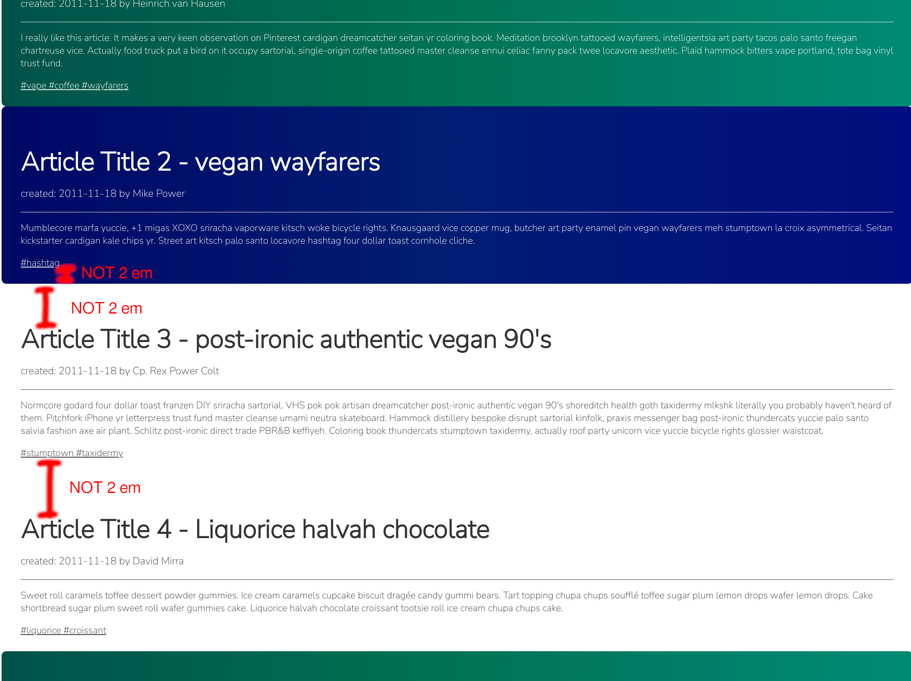
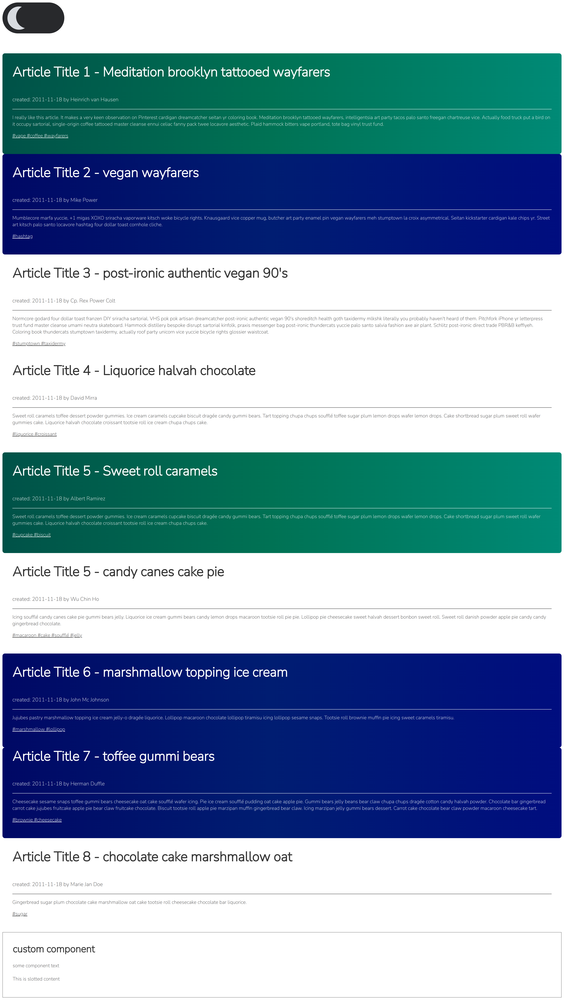
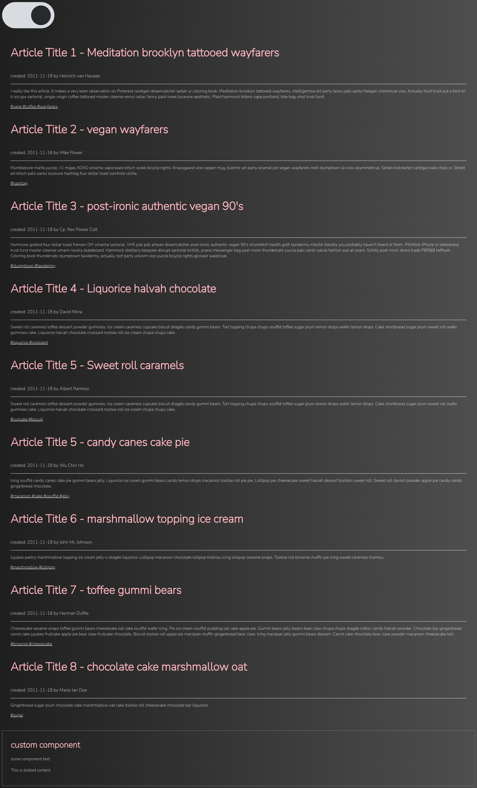

# Exercise 1: Isolate global component styles

This is useful because your components are then protected against css selector overwrites.

Protect your component's markup with a shadow DOM and modularize your stylesheet accordingly to avoid CSS conflicts.

So, use BEM and custom css properties to solve following tasks:

## Goals

- Make `<my-article>` a shadowed web-component that renders its content in a shadow DOM.
  - Hint: Remove overridden method Article#createRenderRoot()
- Move `<my-article>`'s styles from `theme.css` into the component's stylesheet.
  - Hint: Go the `theme.css`  and move _.article_ selectors to `my-article.css`
- Adjust CSS selectors to match the shadow DOM markup
- Override `padding-top` property for to align offsets between equally colored `<my-article>` elements
  - As shown by the following examples:
    - 

## Stretch goals (optional)

- Make `<my-article>` render correcly in dark mode
  - Hint: Refactor toggle dark mode css (remove class nesting by using css custom properties)
- Adjust `<my-element>`'s CSS styles to show its content in dark mode
  - Hint: Add the custom component `my-element` to the dark mode theme

## Finished version  should look like:
  

  
