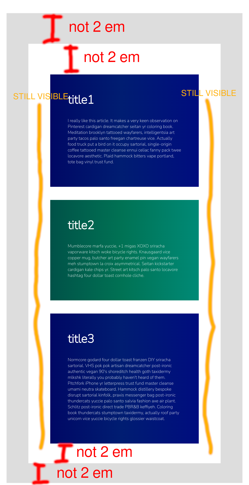
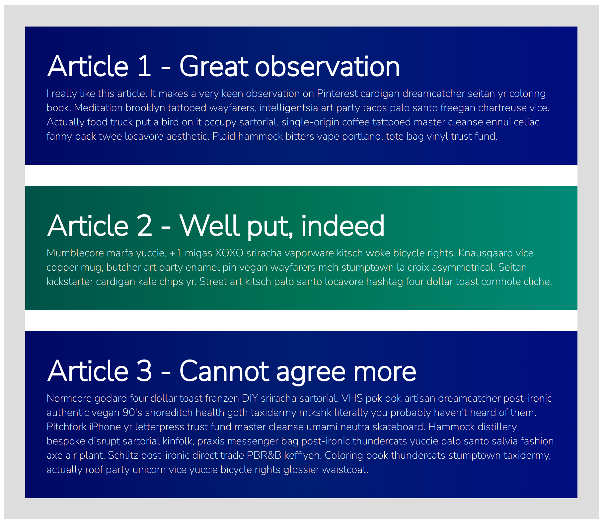

# Exercise 1: Isolate component layout

This is useful because foreign components can not harm your layout.
 
Let's move some CSS properties to make the component layouts independent of their containers. 

## Goals

* Find the container-dependent CSS properties of `<my-article>` and move them to their proper place.
* Adjust properties values if necessary to make them context independent.
  * Hint: The inner title boxes don't have vertical (white) space of 2em

## Stretch goals (optional)

- use a media query [@media (max-width: 1600px) {...}](https://developer.mozilla.org/en-US/docs/Web/CSS/Media_Queries/Using_media_queries#targeting_media_features) to enlarge the vertical (white) space up to 4em on 1600px screen width

## Finished version  should look like:

